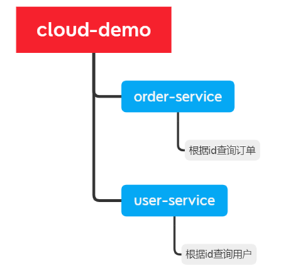

# SpringCloud01|微服务

## 单体架构

**单体架构**：将业务的所有功能集中在一个项目中开发，打成一个包部署。


单体架构的优缺点如下：

**优点：**

- 架构简单
- 部署成本低

**缺点：**

- 耦合度高（维护困难、升级困难）


## 分布式架构

**分布式架构**：根据业务功能对系统做拆分，每个业务功能模块作为独立项目开发，称为一个服务。


分布式架构的优缺点：

**优点：**

- 降低服务耦合
- 有利于服务升级和拓展

**缺点：**

- 服务调用关系错综复杂


分布式架构虽然降低了服务耦合，但是服务拆分时也有很多问题需要思考：

- 服务拆分的粒度如何界定？
- 服务之间如何调用？
- 服务的调用关系如何管理？

人们需要制定一套行之有效的标准来约束分布式架构。


## 微服务

微服务的架构特征：

- 单一职责：微服务拆分粒度更小，每一个服务都对应唯一的业务能力，做到单一职责
- 自治：团队独立、技术独立、数据独立，独立部署和交付
- 面向服务：服务提供统一标准的接口，与语言和技术无关
- 隔离性强：服务调用做好隔离、容错、降级，避免出现级联问题


微服务的上述特性其实是在给分布式架构制定一个标准，进一步降低服务之间的耦合度，提供服务的独立性和灵活性。做到高内聚，低耦合。

因此，可以认为**微服务**是一种经过良好架构设计的**分布式架构方案** 。

但方案该怎么落地？选用什么样的技术栈？全球的互联网公司都在积极尝试自己的微服务落地方案。

其中在Java领域最引人注目的就是SpringCloud提供的方案了。

## SpringCloud

SpringCloud是目前国内使用最广泛的微服务框架。官网地址：https://spring.io/projects/spring-cloud。

SpringCloud集成了各种微服务功能组件，并基于SpringBoot实现了这些组件的自动装配，从而提供了良好的开箱即用体验。

另外，SpringCloud底层是依赖于SpringBoot的，并且有版本的兼容关系，如下：


我们课堂学习的版本是 Hoxton.SR10，因此对应的SpringBoot版本是2.3.x版本。


## 1.5.总结

- 单体架构：简单方便，高度耦合，扩展性差，适合小型项目。例如：学生管理系统

- 分布式架构：松耦合，扩展性好，但架构复杂，难度大。适合大型互联网项目，例如：京东、淘宝

- 微服务：一种良好的分布式架构方案

  ①优点：拆分粒度更小、服务更独立、耦合度更低

  ②缺点：架构非常复杂，运维、监控、部署难度提高

- SpringCloud是微服务架构的一站式解决方案，集成了各种优秀微服务功能组件


# 服务拆分和远程调用

任何分布式架构都离不开服务的拆分，微服务也是一样。

## 服务拆分原则

这里我总结了微服务拆分时的几个原则：

- 不同微服务，不要重复开发相同业务
- 微服务数据独立，不要访问其它微服务的数据库
- 微服务可以将自己的业务暴露为接口，供其它微服务调用


## 服务拆分示例

以微服务cloud-demo为例，其结构如下：



cloud-demo：父工程，管理依赖

- order-service：订单微服务，负责订单相关业务
- user-service：用户微服务，负责用户相关业务

要求：

- 订单微服务和用户微服务都必须有各自的数据库，相互独立
- 订单服务和用户服务都对外暴露Restful的接口
- 订单服务如果需要查询用户信息，只能调用用户服务的Restful接口，不能查询用户数据库


## 实现远程调用案例


在order-service服务中，有一个根据id查询订单的接口：


根据id查询订单，返回值是Order对象，如图：


其中的user为null


在user-service中有一个根据id查询用户的接口：


查询的结果如图：


### 2.3.1.案例需求：

修改order-service中的根据id查询订单业务，要求在查询订单的同时，根据订单中包含的userId查询出用户信息，一起返回。


因此，我们需要在order-service中 向user-service发起一个http的请求，调用http://localhost:8081/user/{userId}这个接口。

大概的步骤是这样的：

- 注册一个RestTemplate的实例到Spring容器
- 修改order-service服务中的OrderService类中的queryOrderById方法，根据Order对象中的userId查询User
- 将查询的User填充到Order对象，一起返回


### 注册RestTemplate

首先，我们在order-service服务中的OrderApplication启动类中，注册RestTemplate实例：

```java
package cn.itcast.order;

import org.mybatis.spring.annotation.MapperScan;
import org.springframework.boot.SpringApplication;
import org.springframework.boot.autoconfigure.SpringBootApplication;
import org.springframework.context.annotation.Bean;
import org.springframework.web.client.RestTemplate;

@MapperScan("cn.itcast.order.mapper")
@SpringBootApplication
public class OrderApplication {

    public static void main(String[] args) {
        SpringApplication.run(OrderApplication.class, args);
    }

    @Bean
    public RestTemplate restTemplate() {
        return new RestTemplate();
    }
}
```


### 实现远程调用

修改order-service服务中的cn.itcast.order.service包下的OrderService类中的queryOrderById方法：


## 提供者与消费者

在服务调用关系中，会有两个不同的角色：

**服务提供者**：一次业务中，被其它微服务调用的服务。（提供接口给其它微服务）

**服务消费者**：一次业务中，调用其它微服务的服务。（调用其它微服务提供的接口）


但是，服务提供者与服务消费者的角色并不是绝对的，而是相对于业务而言。

如果服务A调用了服务B，而服务B又调用了服务C，服务B的角色是什么？

- 对于A调用B的业务而言：A是服务消费者，B是服务提供者
- 对于B调用C的业务而言：B是服务消费者，C是服务提供者


因此，服务B既可以是服务提供者，也可以是服务消费者。


# Nacos注册中心

## 服务注册到nacos

Nacos是SpringCloudAlibaba的组件，而SpringCloudAlibaba也遵循SpringCloud中定义的服务注册、服务发现规范。因此使用Nacos和使用Eureka对于微服务来说，并没有太大区别。

主要差异在于：

- 依赖不同
- 服务地址不同


### 1）引入依赖

在cloud-demo父工程的pom文件中的`<dependencyManagement>`中引入SpringCloudAlibaba的依赖：

```xml
<dependency>
    <groupId>com.alibaba.cloud</groupId>
    <artifactId>spring-cloud-alibaba-dependencies</artifactId>
    <version>2.2.6.RELEASE</version>
    <type>pom</type>
    <scope>import</scope>
</dependency>
```

然后在user-service和order-service中的pom文件中引入nacos-discovery依赖：

```xml
<dependency>
    <groupId>com.alibaba.cloud</groupId>
    <artifactId>spring-cloud-starter-alibaba-nacos-discovery</artifactId>
</dependency>
```


### 2）配置nacos地址

在user-service和order-service的application.yml中添加nacos地址：

```yaml
spring:
  cloud:
    nacos:
      server-addr: localhost:8848
```


### 3）重启

重启微服务后，登录nacos管理页面，可以看到微服务信息：


## 5.3.服务分级存储模型

一个**服务**可以有多个**实例**，例如我们的user-service，可以有:

- 127.0.0.1:8081
- 127.0.0.1:8082
- 127.0.0.1:8083

假如这些实例分布于全国各地的不同机房，例如：

- 127.0.0.1:8081，在上海机房
- 127.0.0.1:8082，在上海机房
- 127.0.0.1:8083，在杭州机房

Nacos就将同一机房内的实例 划分为一个**集群**。

也就是说，user-service是服务，一个服务可以包含多个集群，如杭州、上海，每个集群下可以有多个实例，形成分级模型，如图：


微服务互相访问时，应该尽可能访问同集群实例，因为本地访问速度更快。当本集群内不可用时，才访问其它集群。例如：


杭州机房内的order-service应该优先访问同机房的user-service。


### 5.3.1.给user-service配置集群


修改user-service的application.yml文件，添加集群配置：

```yaml
spring:
  cloud:
    nacos:
      server-addr: localhost:8848
      discovery:
        cluster-name: HZ # 集群名称
```

重启两个user-service实例后，我们可以在nacos控制台看到下面结果：


我们再次复制一个user-service启动配置，添加属性：

```sh
-Dserver.port=8083 -Dspring.cloud.nacos.discovery.cluster-name=SH
```

配置如图所示：


启动UserApplication3后再次查看nacos控制台：


### 同集群优先的负载均衡

默认的`ZoneAvoidanceRule`并不能实现根据同集群优先来实现负载均衡。

因此Nacos中提供了一个`NacosRule`的实现，可以优先从同集群中挑选实例。

1）给order-service配置集群信息

修改order-service的application.yml文件，添加集群配置：

```sh
spring:
  cloud:
    nacos:
      server-addr: localhost:8848
      discovery:
        cluster-name: HZ # 集群名称
```


2）修改负载均衡规则

修改order-service的application.yml文件，修改负载均衡规则：

```yaml
userservice:
  ribbon:
    NFLoadBalancerRuleClassName: com.alibaba.cloud.nacos.ribbon.NacosRule # 负载均衡规则 
```


## 权重配置

实际部署中会出现这样的场景：

服务器设备性能有差异，部分实例所在机器性能较好，另一些较差，我们希望性能好的机器承担更多的用户请求。

但默认情况下NacosRule是同集群内随机挑选，不会考虑机器的性能问题。


因此，Nacos提供了权重配置来控制访问频率，权重越大则访问频率越高。


在nacos控制台，找到user-service的实例列表，点击编辑，即可修改权重：


在弹出的编辑窗口，修改权重：


> **注意**：如果权重修改为0，则该实例永远不会被访问


## 环境隔离

Nacos提供了namespace来实现环境隔离功能。

- nacos中可以有多个namespace
- namespace下可以有group、service等
- 不同namespace之间相互隔离，例如不同namespace的服务互相不可见


### 创建namespace

默认情况下，所有service、data、group都在同一个namespace，名为public：


我们可以点击页面新增按钮，添加一个namespace：


然后，填写表单：


就能在页面看到一个新的namespace：


### 给微服务配置namespace

给微服务配置namespace只能通过修改配置来实现。

例如，修改order-service的application.yml文件：

```yaml
spring:
  cloud:
    nacos:
      server-addr: localhost:8848
      discovery:
        cluster-name: HZ
        namespace: 492a7d5d-237b-46a1-a99a-fa8e98e4b0f9 # 命名空间，填ID
```


重启order-service后，访问控制台，可以看到下面的结果：


此时访问order-service，因为namespace不同，会导致找不到userservice，控制台会报错：


