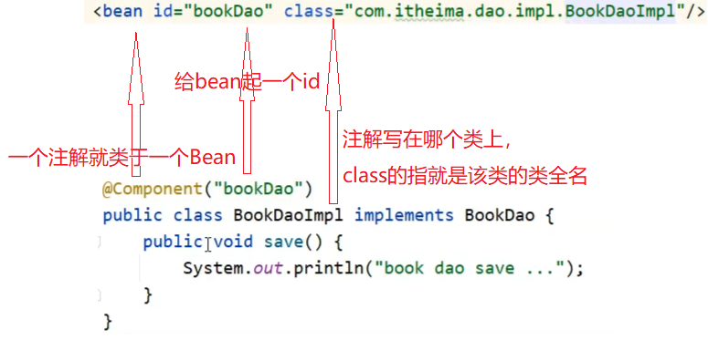
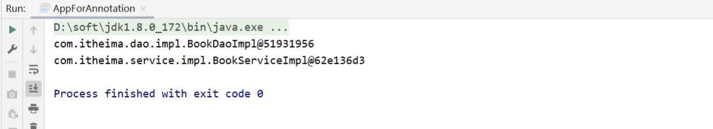
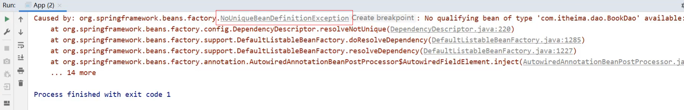
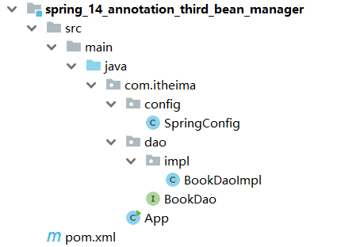
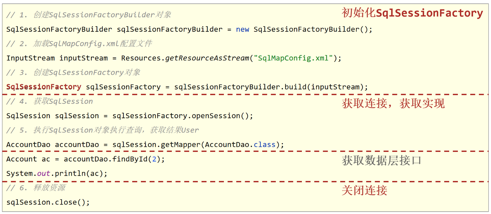
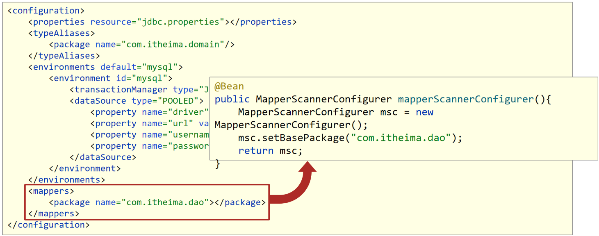

## Spring_day02

## IOC/DI注解开发

Spring的IOC/DI对应的配置开发就已经讲解完成，但是使用起来相对来说还是比较复杂的，复杂的地方在==配置文件==。

前面咱们聊Spring的时候说过，Spring可以简化代码的开发，到现在并没有体会到。

所以Spring到底是如何简化代码开发的呢?

要想真正简化开发，就需要用到Spring的注解开发，Spring对注解支持的版本历程:

* 2.0版开始支持注解
* 2.5版注解功能趋于完善
* 3.0版支持纯注解开发

关于注解开发，我们会讲解两块内容`注解开发定义bean`和`纯注解开发`。

注解开发定义bean用的是2.5版提供的注解，纯注解开发用的是3.0版提供的注解。

### 3.1 环境准备

在学习注解开发之前，先来准备下案例环境:

- 创建一个Maven项目

- pom.xml添加Spring的依赖

  ```xml
  <dependencies>
      <dependency>
          <groupId>org.springframework</groupId>
          <artifactId>spring-context</artifactId>
          <version>5.2.10.RELEASE</version>
      </dependency>
  </dependencies>
  ```

- resources下添加applicationContext.xml

  ```xml
  <?xml version="1.0" encoding="UTF-8"?>
  <beans xmlns="http://www.springframework.org/schema/beans"
         xmlns:xsi="http://www.w3.org/2001/XMLSchema-instance"
         xsi:schemaLocation="
              http://www.springframework.org/schema/beans http://www.springframework.org/schema/beans/spring-beans.xsd">
      <bean id="bookDao" class="com.itheima.dao.impl.BookDaoImpl"/>
  </beans>
  ```

- 添加BookDao、BookDaoImpl、BookService、BookServiceImpl类

  ```java
  public interface BookDao {
      public void save();
  }
  public class BookDaoImpl implements BookDao {
      public void save() {
          System.out.println("book dao save ..." );
      }
  }
  public interface BookService {
      public void save();
  }
  
  public class BookServiceImpl implements BookService {
      public void save() {
          System.out.println("book service save ...");
      }
  }
  
  ```
  
- 创建运行类App

  ```java
  public class App {
      public static void main(String[] args) {
          ApplicationContext ctx = new ClassPathXmlApplicationContext("applicationContext.xml");
          BookDao bookDao = (BookDao) ctx.getBean("bookDao");
          bookDao.save();
      }
  }
  ```

最终创建好的项目结构如下:


### 3.2 注解开发定义bean

在上述环境的基础上，我们来学一学Spring是如何通过注解实现bean的定义开发?

#### 步骤1:删除原XML配置

将配置文件中的`<bean>`标签删除掉

```xml
<bean id="bookDao" class="com.itheima.dao.impl.BookDaoImpl"/>
```

#### 步骤2:Dao上添加注解

在BookDaoImpl类上添加`@Component`注解

```java
@Component("bookDao")
public class BookDaoImpl implements BookDao {
    public void save() {
        System.out.println("book dao save ..." );
    }
}
```

==注意:@Component注解不可以添加在接口上，因为接口是无法创建对象的。==

XML与注解配置的对应关系:



#### 步骤3:配置Spring的注解包扫描

为了让Spring框架能够扫描到写在类上的注解，需要在配置文件上进行包扫描

```xml
<?xml version="1.0" encoding="UTF-8"?>
<beans xmlns="http://www.springframework.org/schema/beans"
       xmlns:xsi="http://www.w3.org/2001/XMLSchema-instance"
       xsi:schemaLocation="
            http://www.springframework.org/schema/beans http://www.springframework.org/schema/beans/spring-beans.xsd">
    <context:component-scan base-package="com.itheima"/>
</beans>
```

**说明:**

component-scan

* component:组件,Spring将管理的bean视作自己的一个组件
* scan:扫描

base-package指定Spring框架扫描的包路径，它会扫描指定包及其子包中的所有类上的注解。

* 包路径越多[如:com.itheima.dao.impl]，扫描的范围越小速度越快
* 包路径越少[如:com.itheima],扫描的范围越大速度越慢
* 一般扫描到项目的组织名称即Maven的groupId下[如:com.itheima]即可。

#### 步骤4：运行程序

运行`App`类查看打印结果


#### 步骤5:Service上添加注解

在BookServiceImpl类上也添加`@Component`交给Spring框架管理

```java
@Component
public class BookServiceImpl implements BookService {
    private BookDao bookDao;

    public void setBookDao(BookDao bookDao) {
        this.bookDao = bookDao;
    }

    public void save() {
        System.out.println("book service save ...");
        bookDao.save();
    }
}
```

#### 步骤6:运行程序

在App类中，从IOC容器中获取BookServiceImpl对应的bean对象，打印

```java
public class App {
    public static void main(String[] args) {
        ApplicationContext ctx = new ClassPathXmlApplicationContext("applicationContext.xml");
        BookDao bookDao = (BookDao) ctx.getBean("bookDao");
        System.out.println(bookDao);
        //按类型获取bean
        BookService bookService = ctx.getBean(BookService.class);
        System.out.println(bookService);
    }
}
```

打印观察结果，两个bean对象都已经打印到控制台


**说明:**

* BookServiceImpl类没有起名称，所以在App中是按照类型来获取bean对象

* @Component注解如果不起名称，会有一个默认值就是`当前类名首字母小写`，所以也可以按照名称获取，如

  ```java
  BookService bookService = (BookService)ctx.getBean("bookServiceImpl");
  System.out.println(bookService);
  ```

对于@Component注解，还衍生出了其他三个注解`@Controller`、`@Service`、`@Repository`

通过查看源码会发现:


这三个注解和@Component注解的作用是一样的，为什么要衍生出这三个呢?

方便我们后期在编写类的时候能很好的区分出这个类是属于`表现层`、`业务层`还是`数据层`的类。

#### 知识点1:@Component等

| 名称 | @Component/@Controller/@Service/@Repository |
| ---- | ------------------------------------------- |
| 类型 | 类注解                                      |
| 位置 | 类定义上方                                  |
| 作用 | 设置该类为spring管理的bean                  |
| 属性 | value（默认）：定义bean的id                 |

### 3.2 纯注解开发模式

上面已经可以使用注解来配置bean,但是依然有用到配置文件，在配置文件中对包进行了扫描，Spring在3.0版已经支持纯注解开发

* Spring3.0开启了纯注解开发模式，使用Java类替代配置文件，开启了Spring快速开发赛道

具体如何实现?

#### 3.2.1 思路分析

实现思路为: 

* 将配置文件applicationContext.xml删除掉，使用类来替换。

#### 3.2.2 实现步骤

##### 步骤1:创建配置类

创建一个配置类`SpringConfig`

```java
public class SpringConfig {
}

```

##### 步骤2:标识该类为配置类

在配置类上添加`@Configuration`注解，将其标识为一个配置类,替换`applicationContext.xml`

```java
@Configuration
public class SpringConfig {
}
```

##### 步骤3:用注解替换包扫描配置

在配置类上添加包扫描注解`@ComponentScan`替换`<context:component-scan base-package=""/>`

```java
@Configuration
@ComponentScan("com.itheima")
public class SpringConfig {
}
```

##### 步骤4:创建运行类并执行

创建一个新的运行类`AppForAnnotation`

```java
public class AppForAnnotation {

    public static void main(String[] args) {
        ApplicationContext ctx = new AnnotationConfigApplicationContext(SpringConfig.class);
        BookDao bookDao = (BookDao) ctx.getBean("bookDao");
        System.out.println(bookDao);
        BookService bookService = ctx.getBean(BookService.class);
        System.out.println(bookService);
    }
}
```

运行AppForAnnotation,可以看到两个对象依然被获取成功



至此，纯注解开发的方式就已经完成了，主要内容包括:

* Java类替换Spring核心配置文件

  

* @Configuration注解用于设定当前类为配置类

* @ComponentScan注解用于设定扫描路径，此注解只能添加一次，多个数据请用数组格式

  ```
  @ComponentScan({com.itheima.service","com.itheima.dao"})
  ```

* 读取Spring核心配置文件初始化容器对象切换为读取Java配置类初始化容器对象

  ```java
  //加载配置文件初始化容器
  ApplicationContext ctx = new ClassPathXmlApplicationContext("applicationContext.xml");
  //加载配置类初始化容器
  ApplicationContext ctx = new AnnotationConfigApplicationContext(SpringConfig.class);
  ```

#### 知识点1：@Configuration

| 名称 | @Configuration              |
| ---- | --------------------------- |
| 类型 | 类注解                      |
| 位置 | 类定义上方                  |
| 作用 | 设置该类为spring配置类      |
| 属性 | value（默认）：定义bean的id |

#### 知识点2：@ComponentScan

| 名称 | @ComponentScan                                           |
| ---- | -------------------------------------------------------- |
| 类型 | 类注解                                                   |
| 位置 | 类定义上方                                               |
| 作用 | 设置spring配置类扫描路径，用于加载使用注解格式定义的bean |
| 属性 | value（默认）：扫描路径，此路径可以逐层向下扫描          |

**小结:**

这一节重点掌握的是使用注解完成Spring的bean管理，需要掌握的内容为:

* 记住@Component、@Controller、@Service、@Repository这四个注解
* applicationContext.xml中`<context:component-san/>`的作用是指定扫描包路径，注解为@ComponentScan
* @Configuration标识该类为配置类，使用类替换applicationContext.xml文件
* ClassPathXmlApplicationContext是加载XML配置文件
* AnnotationConfigApplicationContext是加载配置类

### 3.3 注解开发bean作用范围与生命周期管理

使用注解已经完成了bean的管理，接下来按照前面所学习的内容，将通过配置实现的内容都换成对应的注解实现，包含两部分内容:`bean作用范围`和`bean生命周期`。

#### 3.3.1 环境准备

老规矩，学习之前先来准备环境:

- 创建一个Maven项目

- pom.xml添加Spring的依赖

  ```xml
  <dependencies>
      <dependency>
          <groupId>org.springframework</groupId>
          <artifactId>spring-context</artifactId>
          <version>5.2.10.RELEASE</version>
      </dependency>
  </dependencies>
  ```

- 添加一个配置类`SpringConfig`

  ```java
  @Configuration
  @ComponentScan("com.itheima")
  public class SpringConfig {
  }
  ```

- 添加BookDao、BookDaoImpl类

  ```java
  public interface BookDao {
      public void save();
  }
  @Repository
  public class BookDaoImpl implements BookDao {
      public void save() {
          System.out.println("book dao save ..." );
      }
  }
  ```

- 创建运行类App

  ```java
  public class App {
      public static void main(String[] args) {
          AnnotationConfigApplicationContext ctx = new AnnotationConfigApplicationContext(SpringConfig.class);
          BookDao bookDao1 = ctx.getBean(BookDao.class);
          BookDao bookDao2 = ctx.getBean(BookDao.class);
          System.out.println(bookDao1);
          System.out.println(bookDao2);
      }
  }
  ```

最终创建好的项目结构如下:


#### 3.3.2 Bean的作用范围

(1)先运行App类,在控制台打印两个一摸一样的地址，说明默认情况下bean是单例


(2)要想将BookDaoImpl变成非单例，只需要在其类上添加`@scope`注解

```java
@Repository
//@Scope设置bean的作用范围
@Scope("prototype")
public class BookDaoImpl implements BookDao {

    public void save() {
        System.out.println("book dao save ...");
    }
}
```

再次执行App类，打印结果:


##### 知识点1：@Scope

| 名称 | @Scope                                                       |
| ---- | ------------------------------------------------------------ |
| 类型 | 类注解                                                       |
| 位置 | 类定义上方                                                   |
| 作用 | 设置该类创建对象的作用范围<br/>可用于设置创建出的bean是否为单例对象 |
| 属性 | value（默认）：定义bean作用范围，<br/>==默认值singleton（单例），可选值prototype（非单例）== |

#### 3.3.3 Bean的生命周期

(1)在BookDaoImpl中添加两个方法，`init`和`destroy`,方法名可以任意

```java
@Repository
public class BookDaoImpl implements BookDao {
    public void save() {
        System.out.println("book dao save ...");
    }
    public void init() {
        System.out.println("init ...");
    }
    public void destroy() {
        System.out.println("destroy ...");
    }
}

```

(2)如何对方法进行标识，哪个是初始化方法，哪个是销毁方法?

只需要在对应的方法上添加`@PostConstruct`和`@PreDestroy`注解即可。

```java
@Repository
public class BookDaoImpl implements BookDao {
    public void save() {
        System.out.println("book dao save ...");
    }
    @PostConstruct //在构造方法之后执行，替换 init-method
    public void init() {
        System.out.println("init ...");
    }
    @PreDestroy //在销毁方法之前执行,替换 destroy-method
    public void destroy() {
        System.out.println("destroy ...");
    }
}

```

(3)要想看到两个方法执行，需要注意的是`destroy`只有在容器关闭的时候，才会执行，所以需要修改App的类

```java
public class App {
    public static void main(String[] args) {
        AnnotationConfigApplicationContext ctx = new AnnotationConfigApplicationContext(SpringConfig.class);
        BookDao bookDao1 = ctx.getBean(BookDao.class);
        BookDao bookDao2 = ctx.getBean(BookDao.class);
        System.out.println(bookDao1);
        System.out.println(bookDao2);
        ctx.close(); //关闭容器
    }
}
```

(4)运行App,类查看打印结果，证明init和destroy方法都被执行了。


==**注意:**@PostConstruct和@PreDestroy注解如果找不到，需要导入下面的jar包==

```java
<dependency>
  <groupId>javax.annotation</groupId>
  <artifactId>javax.annotation-api</artifactId>
  <version>1.3.2</version>
</dependency>
```

找不到的原因是，从JDK9以后jdk中的javax.annotation包被移除了，这两个注解刚好就在这个包中。

##### 知识点1：@PostConstruct

| 名称 | @PostConstruct         |
| ---- | ---------------------- |
| 类型 | 方法注解               |
| 位置 | 方法上                 |
| 作用 | 设置该方法为初始化方法 |
| 属性 | 无                     |

##### 知识点2：@PreDestroy

| 名称 | @PreDestroy          |
| ---- | -------------------- |
| 类型 | 方法注解             |
| 位置 | 方法上               |
| 作用 | 设置该方法为销毁方法 |
| 属性 | 无                   |

**小结**


### 3.4 注解开发依赖注入

Spring为了使用注解简化开发，并没有提供`构造函数注入`、`setter注入`对应的注解，只提供了自动装配的注解实现。

#### 3.4.1 环境准备

在学习之前，把案例环境介绍下:

- 创建一个Maven项目

- pom.xml添加Spring的依赖

  ```xml
  <dependencies>
      <dependency>
          <groupId>org.springframework</groupId>
          <artifactId>spring-context</artifactId>
          <version>5.2.10.RELEASE</version>
      </dependency>
  </dependencies>
  ```

- 添加一个配置类`SpringConfig`

  ```java
  @Configuration
  @ComponentScan("com.itheima")
  public class SpringConfig {
  }
  ```

- 添加BookDao、BookDaoImpl、BookService、BookServiceImpl类

  ```java
  public interface BookDao {
      public void save();
  }
  @Repository
  public class BookDaoImpl implements BookDao {
      public void save() {
          System.out.println("book dao save ..." );
      }
  }
  public interface BookService {
      public void save();
  }
  @Service
  public class BookServiceImpl implements BookService {
      private BookDao bookDao;
  	public void setBookDao(BookDao bookDao) {
          this.bookDao = bookDao;
      }
      public void save() {
          System.out.println("book service save ...");
          bookDao.save();
      }
  }
  ```

- 创建运行类App

  ```java
  public class App {
      public static void main(String[] args) {
          AnnotationConfigApplicationContext ctx = new AnnotationConfigApplicationContext(SpringConfig.class);
          BookService bookService = ctx.getBean(BookService.class);
          bookService.save();
      }
  }
  ```

最终创建好的项目结构如下:


环境准备好后，运行后会发现有问题


出现问题的原因是，在BookServiceImpl类中添加了BookDao的属性，并提供了setter方法，但是目前是没有提供配置注入BookDao的，所以bookDao对象为Null,调用其save方法就会报`控指针异常`。

#### 3.4.2 注解实现按照类型注入

对于这个问题使用注解该如何解决?

(1) 在BookServiceImpl类的bookDao属性上添加`@Autowired`注解

```java
@Service
public class BookServiceImpl implements BookService {
    @Autowired
    private BookDao bookDao;
    
//	  public void setBookDao(BookDao bookDao) {
//        this.bookDao = bookDao;
//    }
    public void save() {
        System.out.println("book service save ...");
        bookDao.save();
    }
}
```

**注意:**

* @Autowired可以写在属性上，也可也写在setter方法上，最简单的处理方式是`写在属性上并将setter方法删除掉`
* 为什么setter方法可以删除呢?
  * 自动装配基于反射设计创建对象并通过暴力反射为私有属性进行设值
  * 普通反射只能获取public修饰的内容
  * 暴力反射除了获取public修饰的内容还可以获取private修改的内容
  * 所以此处无需提供setter方法

(2)@Autowired是按照类型注入，那么对应BookDao接口如果有多个实现类，比如添加BookDaoImpl2

```java
@Repository
public class BookDaoImpl2 implements BookDao {
    public void save() {
        System.out.println("book dao save ...2");
    }
}
```

这个时候再次运行App，就会报错



此时，按照类型注入就无法区分到底注入哪个对象，解决方案:`按照名称注入`

* 先给两个Dao类分别起个名称

  ```java
  @Repository("bookDao")
  public class BookDaoImpl implements BookDao {
      public void save() {
          System.out.println("book dao save ..." );
      }
  }
  @Repository("bookDao2")
  public class BookDaoImpl2 implements BookDao {
      public void save() {
          System.out.println("book dao save ...2" );
      }
  }
  ```

  此时就可以注入成功，但是得思考个问题: 

  * @Autowired是按照类型注入的，给BookDao的两个实现起了名称，它还是有两个bean对象，为什么不报错?

  * @Autowired默认按照类型自动装配，如果IOC容器中同类的Bean找到多个，就按照变量名和Bean的名称匹配。因为变量名叫`bookDao`而容器中也有一个`booDao`，所以可以成功注入。

  * 分析下面这种情况是否能完成注入呢?

    

  * 不行，因为按照类型会找到多个bean对象，此时会按照`bookDao`名称去找，因为IOC容器只有名称叫`bookDao1`和`bookDao2`,所以找不到，会报`NoUniqueBeanDefinitionException`

#### 3.4.3 注解实现按照名称注入

当根据类型在容器中找到多个bean,注入参数的属性名又和容器中bean的名称不一致，这个时候该如何解决，就需要使用到`@Qualifier`来指定注入哪个名称的bean对象。

```java
@Service
public class BookServiceImpl implements BookService {
    @Autowired
    @Qualifier("bookDao1")
    private BookDao bookDao;
    
    public void save() {
        System.out.println("book service save ...");
        bookDao.save();
    }
}
```

@Qualifier注解后的值就是需要注入的bean的名称。

==注意:@Qualifier不能独立使用，必须和@Autowired一起使用==

#### 3.4.4 简单数据类型注入

引用类型看完，简单类型注入就比较容易懂了。简单类型注入的是基本数据类型或者字符串类型，下面在`BookDaoImpl`类中添加一个`name`属性，用其进行简单类型注入

```java
@Repository("bookDao")
public class BookDaoImpl implements BookDao {
    private String name;
    public void save() {
        System.out.println("book dao save ..." + name);
    }
}
```

数据类型换了，对应的注解也要跟着换，这次使用`@Value`注解，将值写入注解的参数中就行了

```java
@Repository("bookDao")
public class BookDaoImpl implements BookDao {
    @Value("itheima")
    private String name;
    public void save() {
        System.out.println("book dao save ..." + name);
    }
}
```

注意数据格式要匹配，如将"abc"注入给int值，这样程序就会报错。

介绍完后，会有一种感觉就是这个注解好像没什么用，跟直接赋值是一个效果，还没有直接赋值简单，所以这个注解存在的意义是什么?

#### 3.4.5 注解读取properties配置文件

`@Value`一般会被用在从properties配置文件中读取内容进行使用，具体如何实现?

##### 步骤1：resource下准备properties文件

jdbc.properties

```properties
name=itheima888
```

##### 步骤2: 使用注解加载properties配置文件

在配置类上添加`@PropertySource`注解

```java
@Configuration
@ComponentScan("com.itheima")
@PropertySource("jdbc.properties")
public class SpringConfig {
}

```

##### 步骤3：使用@Value读取配置文件中的内容

```java
@Repository("bookDao")
public class BookDaoImpl implements BookDao {
    @Value("${name}")
    private String name;
    public void save() {
        System.out.println("book dao save ..." + name);
    }
}
```

步骤4:运行程序

运行App类，查看运行结果，说明配置文件中的内容已经被加载到


**注意:**

* 如果读取的properties配置文件有多个，可以使用`@PropertySource`的属性来指定多个

  ```java
  @PropertySource({"jdbc.properties","xxx.properties"})
  ```

* `@PropertySource`注解属性中不支持使用通配符`*`,运行会报错

  ```java
  @PropertySource({"*.properties"})
  ```

* `@PropertySource`注解属性中可以把`classpath:`加上,代表从当前项目的根路径找文件

  ```java
  @PropertySource({"classpath:jdbc.properties"})
  ```

#### 知识点1：@Autowired


| 名称 | @Autowired                                                   |
| ---- | ------------------------------------------------------------ |
| 类型 | 属性注解  或  方法注解（了解）  或  方法形参注解（了解）     |
| 位置 | 属性定义上方  或  标准set方法上方  或  类set方法上方  或  方法形参前面 |
| 作用 | 为引用类型属性设置值                                         |
| 属性 | required：true/false，定义该属性是否允许为null               |

#### 知识点2：@Qualifier

| 名称 | @Qualifier                                           |
| ---- | ---------------------------------------------------- |
| 类型 | 属性注解  或  方法注解（了解）                       |
| 位置 | 属性定义上方  或  标准set方法上方  或  类set方法上方 |
| 作用 | 为引用类型属性指定注入的beanId                       |
| 属性 | value（默认）：设置注入的beanId                      |

#### 知识点3：@Value

| 名称 | @Value                                               |
| ---- | ---------------------------------------------------- |
| 类型 | 属性注解  或  方法注解（了解）                       |
| 位置 | 属性定义上方  或  标准set方法上方  或  类set方法上方 |
| 作用 | 为  基本数据类型  或  字符串类型  属性设置值         |
| 属性 | value（默认）：要注入的属性值                        |

#### 知识点4：@PropertySource

| 名称 | @PropertySource                                              |
| ---- | ------------------------------------------------------------ |
| 类型 | 类注解                                                       |
| 位置 | 类定义上方                                                   |
| 作用 | 加载properties文件中的属性值                                 |
| 属性 | value（默认）：设置加载的properties文件对应的文件名或文件名组成的数组 |

## 4，IOC/DI注解开发管理第三方bean

前面定义bean的时候都是在自己开发的类上面写个注解就完成了，但如果是第三方的类，这些类都是在jar包中，我们没有办法在类上面添加注解，这个时候该怎么办?

遇到上述问题，我们就需要有一种更加灵活的方式来定义bean,这种方式不能在原始代码上面书写注解，一样能定义bean,这就用到了一个全新的注解==@Bean==。

这个注解该如何使用呢?

咱们把之前使用配置方式管理的数据源使用注解再来一遍，通过这个案例来学习下@Bean的使用。

### 4.1 环境准备

学习@Bean注解之前先来准备环境:

- 创建一个Maven项目

- pom.xml添加Spring的依赖

  ```xml
  <dependencies>
      <dependency>
          <groupId>org.springframework</groupId>
          <artifactId>spring-context</artifactId>
          <version>5.2.10.RELEASE</version>
      </dependency>
  </dependencies>
  ```

- 添加一个配置类`SpringConfig`

  ```java
  @Configuration
  public class SpringConfig {
  }
  ```

- 添加BookDao、BookDaoImpl类

  ```java
  public interface BookDao {
      public void save();
  }
  @Repository
  public class BookDaoImpl implements BookDao {
      public void save() {
          System.out.println("book dao save ..." );
      }
  }
  ```

- 创建运行类App

  ```java
  public class App {
      public static void main(String[] args) {
          AnnotationConfigApplicationContext ctx = new AnnotationConfigApplicationContext(SpringConfig.class);
      }
  }
  ```

最终创建好的项目结构如下:



### 4.2 注解开发管理第三方bean

在上述环境中完成对`Druid`数据源的管理，具体的实现步骤为:

#### 步骤1:导入对应的jar包

```xml
<dependency>
    <groupId>com.alibaba</groupId>
    <artifactId>druid</artifactId>
    <version>1.1.16</version>
</dependency>
```

#### 步骤2:在配置类中添加一个方法

注意该方法的返回值就是要创建的Bean对象类型

```java
@Configuration
public class SpringConfig {
    public DataSource dataSource(){
        DruidDataSource ds = new DruidDataSource();
        ds.setDriverClassName("com.mysql.jdbc.Driver");
        ds.setUrl("jdbc:mysql://localhost:3306/spring_db");
        ds.setUsername("root");
        ds.setPassword("root");
        return ds;
    }
}
```

#### 步骤3:在方法上添加`@Bean`注解

@Bean注解的作用是将方法的返回值制作为Spring管理的一个bean对象

```java
@Configuration
public class SpringConfig {
	@Bean
    public DataSource dataSource(){
        DruidDataSource ds = new DruidDataSource();
        ds.setDriverClassName("com.mysql.jdbc.Driver");
        ds.setUrl("jdbc:mysql://localhost:3306/spring_db");
        ds.setUsername("root");
        ds.setPassword("root");
        return ds;
    }
}
```

**注意:不能使用`DataSource ds = new DruidDataSource()`**

因为DataSource接口中没有对应的setter方法来设置属性。

#### 步骤4:从IOC容器中获取对象并打印

```java
public class App {
    public static void main(String[] args) {
        AnnotationConfigApplicationContext ctx = new AnnotationConfigApplicationContext(SpringConfig.class);
        DataSource dataSource = ctx.getBean(DataSource.class);
        System.out.println(dataSource);
    }
}
```

至此使用@Bean来管理第三方bean的案例就已经完成。

如果有多个bean要被Spring管理，直接在配置类中多些几个方法，方法上添加@Bean注解即可。

### 4.3 引入外部配置类

如果把所有的第三方bean都配置到Spring的配置类`SpringConfig`中，虽然可以，但是不利于代码阅读和分类管理，所有我们就想能不能按照类别将这些bean配置到不同的配置类中?

对于数据源的bean,我们新建一个`JdbcConfig`配置类，并把数据源配置到该类下。

```java
public class JdbcConfig {
	@Bean
    public DataSource dataSource(){
        DruidDataSource ds = new DruidDataSource();
        ds.setDriverClassName("com.mysql.jdbc.Driver");
        ds.setUrl("jdbc:mysql://localhost:3306/spring_db");
        ds.setUsername("root");
        ds.setPassword("root");
        return ds;
    }
}
```

现在的问题是，这个配置类如何能被Spring配置类加载到，并创建DataSource对象在IOC容器中?

针对这个问题，有两个解决方案:

#### 4.3.1 使用包扫描引入

##### 步骤1:在Spring的配置类上添加包扫描

```java
@Configuration
@ComponentScan("com.itheima.config")
public class SpringConfig {
	
}
```

##### 步骤2:在JdbcConfig上添加配置注解

JdbcConfig类要放入到`com.itheima.config`包下，需要被Spring的配置类扫描到即可

```java
@Configuration
public class JdbcConfig {
	@Bean
    public DataSource dataSource(){
        DruidDataSource ds = new DruidDataSource();
        ds.setDriverClassName("com.mysql.jdbc.Driver");
        ds.setUrl("jdbc:mysql://localhost:3306/spring_db");
        ds.setUsername("root");
        ds.setPassword("root");
        return ds;
    }
}
```

##### 步骤3:运行程序

依然能获取到bean对象并打印控制台。

这种方式虽然能够扫描到，但是不能很快的知晓都引入了哪些配置类，所有这种方式不推荐使用。

#### 4.3.2 使用`@Import`引入

方案一实现起来有点小复杂，Spring早就想到了这一点，于是又给我们提供了第二种方案。

这种方案可以不用加`@Configuration`注解，但是必须在Spring配置类上使用`@Import`注解手动引入需要加载的配置类

##### 步骤1:去除JdbcConfig类上的注解

```java
public class JdbcConfig {
	@Bean
    public DataSource dataSource(){
        DruidDataSource ds = new DruidDataSource();
        ds.setDriverClassName("com.mysql.jdbc.Driver");
        ds.setUrl("jdbc:mysql://localhost:3306/spring_db");
        ds.setUsername("root");
        ds.setPassword("root");
        return ds;
    }
}
```

##### 步骤2:在Spring配置类中引入

```java
@Configuration
//@ComponentScan("com.itheima.config")
@Import({JdbcConfig.class})
public class SpringConfig {
	
}
```

**注意:**

* 扫描注解可以移除

* @Import参数需要的是一个数组，可以引入多个配置类。

* @Import注解在配置类中只能写一次，下面的方式是==不允许的==

  ```java
  @Configuration
  //@ComponentScan("com.itheima.config")
  @Import(JdbcConfig.class)
  @Import(Xxx.class)
  public class SpringConfig {
  	
  }
  ```

##### 步骤3:运行程序

依然能获取到bean对象并打印控制台

### 知识点1：@Bean

| 名称 | @Bean                                  |
| ---- | -------------------------------------- |
| 类型 | 方法注解                               |
| 位置 | 方法定义上方                           |
| 作用 | 设置该方法的返回值作为spring管理的bean |
| 属性 | value（默认）：定义bean的id            |

### 知识点2：@Import

| 名称 | @Import                                                      |
| ---- | ------------------------------------------------------------ |
| 类型 | 类注解                                                       |
| 位置 | 类定义上方                                                   |
| 作用 | 导入配置类                                                   |
| 属性 | value（默认）：定义导入的配置类类名，<br/>当配置类有多个时使用数组格式一次性导入多个配置类 |

### 4.4 注解开发实现为第三方bean注入资源

在使用@Bean创建bean对象的时候，如果方法在创建的过程中需要其他资源该怎么办?

这些资源会有两大类，分别是`简单数据类型` 和`引用数据类型`。

#### 4.4.1 简单数据类型

##### 4.4.1.1 需求分析

对于下面代码关于数据库的四要素不应该写死在代码中，应该是从properties配置文件中读取。如何来优化下面的代码?

```java
public class JdbcConfig {
	@Bean
    public DataSource dataSource(){
        DruidDataSource ds = new DruidDataSource();
        ds.setDriverClassName("com.mysql.jdbc.Driver");
        ds.setUrl("jdbc:mysql://localhost:3306/spring_db");
        ds.setUsername("root");
        ds.setPassword("root");
        return ds;
    }
}
```

##### 4.4.1.2 注入简单数据类型步骤

###### 步骤1:类中提供四个属性

```java
public class JdbcConfig {
    private String driver;
    private String url;
    private String userName;
    private String password;
	@Bean
    public DataSource dataSource(){
        DruidDataSource ds = new DruidDataSource();
        ds.setDriverClassName("com.mysql.jdbc.Driver");
        ds.setUrl("jdbc:mysql://localhost:3306/spring_db");
        ds.setUsername("root");
        ds.setPassword("root");
        return ds;
    }
}
```

###### 步骤2:使用`@Value`注解引入值

```java
public class JdbcConfig {
    @Value("com.mysql.jdbc.Driver")
    private String driver;
    @Value("jdbc:mysql://localhost:3306/spring_db")
    private String url;
    @Value("root")
    private String userName;
    @Value("password")
    private String password;
	@Bean
    public DataSource dataSource(){
        DruidDataSource ds = new DruidDataSource();
        ds.setDriverClassName(driver);
        ds.setUrl(url);
        ds.setUsername(userName);
        ds.setPassword(password);
        return ds;
    }
}
```

###### 扩展

现在的数据库连接四要素还是写在代码中，需要做的是将这些内容提

取到jdbc.properties配置文件，大家思考下该如何实现?

> 1.resources目录下添加jdbc.properties
>
> 2.配置文件中提供四个键值对分别是数据库的四要素
>
> 3.使用@PropertySource加载jdbc.properties配置文件
>
> 4.修改@Value注解属性的值，将其修改为`${key}`，key就是键值对中的键的值

具体的实现就交由大家自行实现下。

#### 4.4.2 引用数据类型

##### 4.4.2.1 需求分析 

假设在构建DataSource对象的时候，需要用到BookDao对象，该如何把BookDao对象注入进方法内让其使用呢?

```java
public class JdbcConfig {
	@Bean
    public DataSource dataSource(){
        DruidDataSource ds = new DruidDataSource();
        ds.setDriverClassName("com.mysql.jdbc.Driver");
        ds.setUrl("jdbc:mysql://localhost:3306/spring_db");
        ds.setUsername("root");
        ds.setPassword("root");
        return ds;
    }
}
```

##### 4.4.2.2 注入引用数据类型步骤

###### 步骤1:在SpringConfig中扫描BookDao

扫描的目的是让Spring能管理到BookDao,也就是说要让IOC容器中有一个bookDao对象

```java
@Configuration
@ComponentScan("com.itheima.dao")
@Import({JdbcConfig.class})
public class SpringConfig {
}
```

###### 步骤2:在JdbcConfig类的方法上添加参数

```java
@Bean
public DataSource dataSource(BookDao bookDao){
    System.out.println(bookDao);
    DruidDataSource ds = new DruidDataSource();
    ds.setDriverClassName(driver);
    ds.setUrl(url);
    ds.setUsername(userName);
    ds.setPassword(password);
    return ds;
}
```

==引用类型注入只需要为bean定义方法设置形参即可，容器会根据类型自动装配对象。==

###### 步骤3:运行程序


## 5，注解开发总结

前面我们已经完成了XML配置和注解的开发实现，至于两者之间的差异，咱们放在一块去对比回顾下:


## 6，Spring整合

课程学习到这里，已经对Spring有一个简单的认识了，Spring有一个容器，叫做IoC容器，里面保存bean。在进行企业级开发的时候，其实除了将自己写的类让Spring管理之外，还有一部分重要的工作就是使用第三方的技术。前面已经讲了如何管理第三方bean了，下面结合IoC和DI，整合2个常用技术，进一步加深对Spring的使用理解。

### 6.1 Spring整合Mybatis思路分析

#### 6.1.1 环境准备

在准备环境的过程中，我们也来回顾下Mybatis开发的相关内容:

##### 步骤1:准备数据库表

Mybatis是来操作数据库表，所以先创建一个数据库及表

```sql
create database spring_db character set utf8;
use spring_db;
create table tbl_account(
    id int primary key auto_increment,
    name varchar(35),
    money double
);
```

##### 步骤2:创建项目导入jar包

项目的pom.xml添加相关依赖

```xml
<dependencies>
    <dependency>
        <groupId>org.springframework</groupId>
        <artifactId>spring-context</artifactId>
        <version>5.2.10.RELEASE</version>
    </dependency>
    <dependency>
        <groupId>com.alibaba</groupId>
        <artifactId>druid</artifactId>
        <version>1.1.16</version>
    </dependency>
    <dependency>
        <groupId>org.mybatis</groupId>
        <artifactId>mybatis</artifactId>
        <version>3.5.6</version>
    </dependency>
    <dependency>
        <groupId>mysql</groupId>
        <artifactId>mysql-connector-java</artifactId>
        <version>5.1.47</version>
    </dependency>
</dependencies>
```

##### 步骤3:根据表创建模型类

```java
public class Account implements Serializable {

    private Integer id;
    private String name;
    private Double money;
	//setter...getter...toString...方法略    
}
```

##### 步骤4:创建Dao接口

```java
public interface AccountDao {

    @Insert("insert into tbl_account(name,money)values(#{name},#{money})")
    void save(Account account);

    @Delete("delete from tbl_account where id = #{id} ")
    void delete(Integer id);

    @Update("update tbl_account set name = #{name} , money = #{money} where id = #{id} ")
    void update(Account account);

    @Select("select * from tbl_account")
    List<Account> findAll();

    @Select("select * from tbl_account where id = #{id} ")
    Account findById(Integer id);
}
```

##### 步骤5:创建Service接口和实现类

```java
public interface AccountService {

    void save(Account account);

    void delete(Integer id);

    void update(Account account);

    List<Account> findAll();

    Account findById(Integer id);

}

@Service
public class AccountServiceImpl implements AccountService {

    @Autowired
    private AccountDao accountDao;

    public void save(Account account) {
        accountDao.save(account);
    }

    public void update(Account account){
        accountDao.update(account);
    }

    public void delete(Integer id) {
        accountDao.delete(id);
    }

    public Account findById(Integer id) {
        return accountDao.findById(id);
    }

    public List<Account> findAll() {
        return accountDao.findAll();
    }
}
```

##### 步骤6:添加jdbc.properties文件

resources目录下添加，用于配置数据库连接四要素

```properties
jdbc.driver=com.mysql.jdbc.Driver
jdbc.url=jdbc:mysql://localhost:3306/spring_db?useSSL=false
jdbc.username=root
jdbc.password=root
```

useSSL:关闭MySQL的SSL连接

##### 步骤7:添加Mybatis核心配置文件

```xml
<?xml version="1.0" encoding="UTF-8"?>
<!DOCTYPE configuration
        PUBLIC "-//mybatis.org//DTD Config 3.0//EN"
        "http://mybatis.org/dtd/mybatis-3-config.dtd">
<configuration>
    <!--读取外部properties配置文件-->
    <properties resource="jdbc.properties"></properties>
    <!--别名扫描的包路径-->
    <typeAliases>
        <package name="com.itheima.domain"/>
    </typeAliases>
    <!--数据源-->
    <environments default="mysql">
        <environment id="mysql">
            <transactionManager type="JDBC"></transactionManager>
            <dataSource type="POOLED">
                <property name="driver" value="${jdbc.driver}"></property>
                <property name="url" value="${jdbc.url}"></property>
                <property name="username" value="${jdbc.username}"></property>
                <property name="password" value="${jdbc.password}"></property>
            </dataSource>
        </environment>
    </environments>
    <!--映射文件扫描包路径-->
    <mappers>
        <package name="com.itheima.dao"></package>
    </mappers>
</configuration>
```

##### 步骤8:编写应用程序

```java
public class App {
    public static void main(String[] args) throws IOException {
        // 1. 创建SqlSessionFactoryBuilder对象
        SqlSessionFactoryBuilder sqlSessionFactoryBuilder = new SqlSessionFactoryBuilder();
        // 2. 加载SqlMapConfig.xml配置文件
        InputStream inputStream = Resources.getResourceAsStream("SqlMapConfig.xml.bak");
        // 3. 创建SqlSessionFactory对象
        SqlSessionFactory sqlSessionFactory = sqlSessionFactoryBuilder.build(inputStream);
        // 4. 获取SqlSession
        SqlSession sqlSession = sqlSessionFactory.openSession();
        // 5. 执行SqlSession对象执行查询，获取结果User
        AccountDao accountDao = sqlSession.getMapper(AccountDao.class);

        Account ac = accountDao.findById(1);
        System.out.println(ac);

        // 6. 释放资源
        sqlSession.close();
    }
}
```

##### 步骤9:运行程序


#### 6.1.2 整合思路分析

Mybatis的基础环境我们已经准备好了，接下来就得分析下在上述的内容中，哪些对象可以交给Spring来管理?

* Mybatis程序核心对象分析

  

  从图中可以获取到，真正需要交给Spring管理的是==SqlSessionFactory==

* 整合Mybatis，就是将Mybatis用到的内容交给Spring管理，分析下配置文件

  

  **说明:**

  * 第一行读取外部properties配置文件，Spring有提供具体的解决方案`@PropertySource`,需要交给Spring
  * 第二行起别名包扫描，为SqlSessionFactory服务的，需要交给Spring
  * 第三行主要用于做连接池，Spring之前我们已经整合了Druid连接池，这块也需要交给Spring
  * 前面三行一起都是为了创建SqlSession对象用的，那么用Spring管理SqlSession对象吗?回忆下SqlSession是由SqlSessionFactory创建出来的，所以只需要将SqlSessionFactory交给Spring管理即可。
  * 第四行是Mapper接口和映射文件[如果使用注解就没有该映射文件]，这个是在获取到SqlSession以后执行具体操作的时候用，所以它和SqlSessionFactory创建的时机都不在同一个时间，可能需要单独管理。

### 6.2 Spring整合Mybatis

前面我们已经分析了Spring与Mybatis的整合，大体需要做两件事，

第一件事是:Spring要管理MyBatis中的SqlSessionFactory

第二件事是:Spring要管理Mapper接口的扫描

具体该如何实现，具体的步骤为:

#### 步骤1:项目中导入整合需要的jar包

```xml
<dependency>
    <!--Spring操作数据库需要该jar包-->
    <groupId>org.springframework</groupId>
    <artifactId>spring-jdbc</artifactId>
    <version>5.2.10.RELEASE</version>
</dependency>
<dependency>
    <!--
		Spring与Mybatis整合的jar包
		这个jar包mybatis在前面，是Mybatis提供的
	-->
    <groupId>org.mybatis</groupId>
    <artifactId>mybatis-spring</artifactId>
    <version>1.3.0</version>
</dependency>
```

#### 步骤2:创建Spring的主配置类

```java
//配置类注解
@Configuration
//包扫描，主要扫描的是项目中的AccountServiceImpl类
@ComponentScan("com.itheima")
public class SpringConfig {
}

```

#### 步骤3:创建数据源的配置类

在配置类中完成数据源的创建

```java
public class JdbcConfig {
    @Value("${jdbc.driver}")
    private String driver;
    @Value("${jdbc.url}")
    private String url;
    @Value("${jdbc.username}")
    private String userName;
    @Value("${jdbc.password}")
    private String password;

    @Bean
    public DataSource dataSource(){
        DruidDataSource ds = new DruidDataSource();
        ds.setDriverClassName(driver);
        ds.setUrl(url);
        ds.setUsername(userName);
        ds.setPassword(password);
        return ds;
    }
}
```

#### 步骤4:主配置类中读properties并引入数据源配置类

```java
@Configuration
@ComponentScan("com.itheima")
@PropertySource("classpath:jdbc.properties")
@Import(JdbcConfig.class)
public class SpringConfig {
}

```

#### 步骤5:创建Mybatis配置类并配置SqlSessionFactory

```java
public class MybatisConfig {
    //定义bean，SqlSessionFactoryBean，用于产生SqlSessionFactory对象
    @Bean
    public SqlSessionFactoryBean sqlSessionFactory(DataSource dataSource){
        SqlSessionFactoryBean ssfb = new SqlSessionFactoryBean();
        //设置模型类的别名扫描
        ssfb.setTypeAliasesPackage("com.itheima.domain");
        //设置数据源
        ssfb.setDataSource(dataSource);
        return ssfb;
    }
    //定义bean，返回MapperScannerConfigurer对象
    @Bean
    public MapperScannerConfigurer mapperScannerConfigurer(){
        MapperScannerConfigurer msc = new MapperScannerConfigurer();
        msc.setBasePackage("com.itheima.dao");
        return msc;
    }
}
```

**说明:**

* 使用SqlSessionFactoryBean封装SqlSessionFactory需要的环境信息

  

  * SqlSessionFactoryBean是前面我们讲解FactoryBean的一个子类，在该类中将SqlSessionFactory的创建进行了封装，简化对象的创建，我们只需要将其需要的内容设置即可。
  * 方法中有一个参数为dataSource,当前Spring容器中已经创建了Druid数据源，类型刚好是DataSource类型，此时在初始化SqlSessionFactoryBean这个对象的时候，发现需要使用DataSource对象，而容器中刚好有这么一个对象，就自动加载了DruidDataSource对象。

* 使用MapperScannerConfigurer加载Dao接口，创建代理对象保存到IOC容器中

  

  * 这个MapperScannerConfigurer对象也是MyBatis提供的专用于整合的jar包中的类，用来处理原始配置文件中的mappers相关配置，加载数据层的Mapper接口类
  * MapperScannerConfigurer有一个核心属性basePackage，就是用来设置所扫描的包路径

#### 步骤6:主配置类中引入Mybatis配置类

```java
@Configuration
@ComponentScan("com.itheima")
@PropertySource("classpath:jdbc.properties")
@Import({JdbcConfig.class,MybatisConfig.class})
public class SpringConfig {
}
```

#### 步骤7:编写运行类

在运行类中，从IOC容器中获取Service对象，调用方法获取结果

```java
public class App2 {
    public static void main(String[] args) {
        ApplicationContext ctx = new AnnotationConfigApplicationContext(SpringConfig.class);

        AccountService accountService = ctx.getBean(AccountService.class);

        Account ac = accountService.findById(1);
        System.out.println(ac);
    }
}

```

#### 步骤8:运行程序


支持Spring与Mybatis的整合就已经完成了，其中主要用到的两个类分别是:

* ==SqlSessionFactoryBean==
* ==MapperScannerConfigurer==

### 6.3 Spring整合Junit

整合Junit与整合Druid和MyBatis差异比较大，为什么呢？Junit是一个搞单元测试用的工具，它不是我们程序的主体，也不会参加最终程序的运行，从作用上来说就和之前的东西不一样，它不是做功能的，看做是一个辅助工具就可以了。

#### 6.3.1 环境准备

这块环境，大家可以直接使用Spring与Mybatis整合的环境即可。当然也可以重新创建一个，因为内容是一模一样，所以我们直接来看下项目结构即可:


#### 6.3.2 整合Junit步骤

在上述环境的基础上，我们来对Junit进行整合。

##### 步骤1:引入依赖

pom.xml

```xml
<dependency>
    <groupId>junit</groupId>
    <artifactId>junit</artifactId>
    <version>4.12</version>
    <scope>test</scope>
</dependency>

<dependency>
    <groupId>org.springframework</groupId>
    <artifactId>spring-test</artifactId>
    <version>5.2.10.RELEASE</version>
</dependency>
```

##### 步骤2:编写测试类

在test\java下创建一个AccountServiceTest,这个名字任意

```java
//设置类运行器
@RunWith(SpringJUnit4ClassRunner.class)
//设置Spring环境对应的配置类
@ContextConfiguration(classes = {SpringConfiguration.class}) //加载配置类
//@ContextConfiguration(locations={"classpath:applicationContext.xml"})//加载配置文件
public class AccountServiceTest {
    //支持自动装配注入bean
    @Autowired
    private AccountService accountService;
    @Test
    public void testFindById(){
        System.out.println(accountService.findById(1));

    }
    @Test
    public void testFindAll(){
        System.out.println(accountService.findAll());
    }
}
```

**注意:**

* 单元测试，如果测试的是注解配置类，则使用`@ContextConfiguration(classes = 配置类.class)`
* 单元测试，如果测试的是配置文件，则使用`@ContextConfiguration(locations={配置文件名,...})`
* Junit运行后是基于Spring环境运行的，所以Spring提供了一个专用的类运行器，这个务必要设置，这个类运行器就在Spring的测试专用包中提供的，导入的坐标就是这个东西`SpringJUnit4ClassRunner`
* 上面两个配置都是固定格式，当需要测试哪个bean时，使用自动装配加载对应的对象，下面的工作就和以前做Junit单元测试完全一样了

#### 知识点1：@RunWith

| 名称 | @RunWith                          |
| ---- | --------------------------------- |
| 类型 | 测试类注解                        |
| 位置 | 测试类定义上方                    |
| 作用 | 设置JUnit运行器                   |
| 属性 | value（默认）：运行所使用的运行期 |

#### 知识点2：@ContextConfiguration

| 名称 | @ContextConfiguration                                        |
| ---- | ------------------------------------------------------------ |
| 类型 | 测试类注解                                                   |
| 位置 | 测试类定义上方                                               |
| 作用 | 设置JUnit加载的Spring核心配置                                |
| 属性 | classes：核心配置类，可以使用数组的格式设定加载多个配置类<br/>locations:配置文件，可以使用数组的格式设定加载多个配置文件名称 |